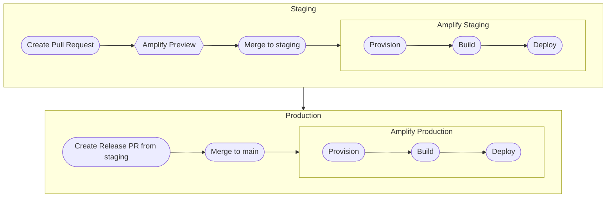

### Learning Resources AWS Infrastructure Diagram

The frontend application is hosted on AWS on the AWS Amplify service. Amplify is currently setup to watch for changes on the corresponding branch and deploy those new changes immediately.

There are currently two Amplify applications, one for each environment/branch.
The production environment is linked to the `main` branch
The staging environment is linked to the `staging` branch which is the default development branch.

There is currently only one Contentful environment, which is `master`. Both staging and prod pull content from the `master` environment on Contentful.

All new pull requests on `staging` will spin up a Preview; Amplify deploys the code and generates a preview URL where you can test the code in a PR environment.

### Environment variables
- `contentful_cda_access_token`: Access token for connecting to contenful

### Deployment strategy

