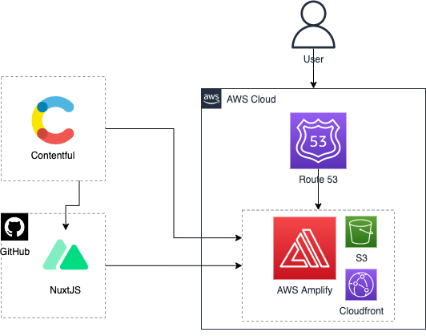
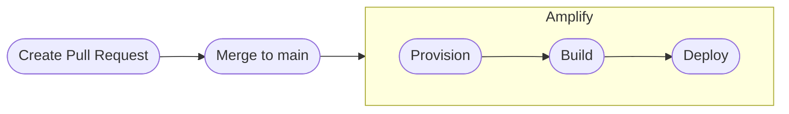

### Learning Resources AWS Infrastructure Diagram

The frontend application is hosted on AWS on the AWS Amplify service. Amplify is currently setup to watch for changes on the `main` branch and deploy those new changes immediately.

### Environment variables
- `contentful_cda_access_token`: Access token for connecting to contenful

### Deployment strategy

